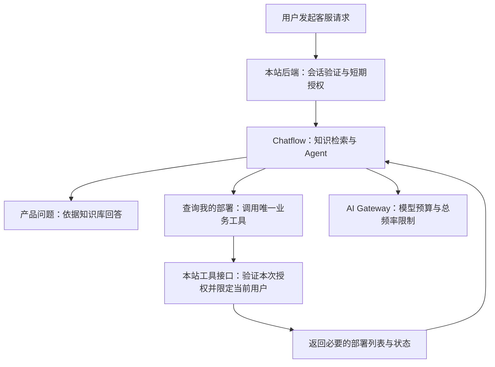

# Pitch：知识库客服与部署查询

状态：Cloudflare AI Gateway 与 DeepSeek V4.1 Flash 的无账本版本已通过核心复验，供应商 key 已移入 Secrets Store，Dify 网关 token 加密保存；未批准生产发布。验证结果与上线前检查见[实施状态](../reference/support-agent-implementation.md)。

## 问题（Problem）

访客想了解套餐、部署方式或常见问题时，需要在网页里自行寻找答案。已注册用户询问“我现在有哪些部署、状态如何”时，现有客服无法查询，只能让用户去控制台查看。

现有客服的产品资料直接写在提示词中，更新容易遗漏。它也没有跨实例的费用上限，公开展示后，无关聊天、重复请求和 Agent 多轮调用都可能带来额外支出。

这次要交付一个可对外展示、也能处理真实客服咨询的有限功能版本：依据产品知识回答问题，并为已登录用户查询自己的已有部署。展示是否成立，以资料回答有依据、部署查询确实成功、超额请求确实停止为准。

## 投入上限（Appetite）

建议投入一名开发者一周，包含知识资料整理、Chatflow 配置、部署查询接入、费用控制及预览环境验证。这是愿意投入的上限，不是工期估算，待评审确认。

四项核心能力都保留：替换应用、知识库问答、单一部署查询工具、经过测试的费用限制。时间不足时先缩减视觉优化、资料覆盖广度和报表展示；不削减鉴权、费用上限或越权测试。若这些基础条件无法在上限内完成，暂停公开发布并重新界定范围，不自动延长。

## 方案（Solution）

### 使用现有 Chatflow 替换旧应用

以用户已转换的 Chatflow 为目标应用，按后续确认使用 `deepseek-flash`（DeepSeek V4.1 Flash），将回答用的 LLM 节点替换为 Agent 节点。实施时核对实际发布版本、节点配置和模型的工具调用兼容性；立项时的旧普通聊天 DSL 已由验证后的 Chatflow 定义替换。

网站继续使用通用 `/api/support/chat` 接口。切换所需的平台字段留在适配器中，页面不依赖 Dify 的节点、应用 ID 或密钥。验证后导出不含秘密变量的 Chatflow DSL，替换 `support/dify/app.yml`，更新导入说明；实际应用标识和部署地址留在运行环境。

### 英文 Markdown 知识库

在 `support/knowledge/` 维护三个英文源文件，导入 Dify Knowledge：

| 文件            | 内容边界                                                 |
| --------------- | -------------------------------------------------------- |
| `faq.md`        | 常见产品与使用问题、常见故障的用户侧检查、人工联系途径   |
| `pricing.md`    | 经核对的现行套餐、计费周期、包含内容、额外费用与价格来源 |
| `deployment.md` | 部署前提、流程、运行时选择、生命周期和状态含义           |

资料依据网站现行页面及实际产品行为整理，每份标明核对日期和公开来源。遇到价格或规则冲突，先修正文档，不让模型自行选择。部署机制介绍用户需要理解的行为，不写内部机器、网络、凭据或运维路径。

采用 Chatflow 知识检索节点，将相关片段交给 Agent 回答产品问题。Agent 不具备联网搜索或任意读取外部资料的能力。英文是知识源的语言，回答仍跟随访客语言。

“仅限知识库范围”具体指：产品事实只能来自检索到的资料；资料不足时澄清、说明没有依据或提供人工联系入口。无关问题简短拒绝，不展开聊天。回复标明可核对的文档名称或公开来源，不要求重做整个聊天窗口的渲染方式。

部署查询是唯一例外：用户自己的部署事实来自授权工具的实时结果，不能从知识库推测。问候、澄清、登录提示和服务错误提示不受产品事实来源限制。

### 只开放一个业务工具

Agent 只增加 `list_my_deployments` 这一项业务工具。知识检索由前置节点完成，不增加第二个业务动作。

用户打开客服时能看到产品咨询入口和“查询我的部署”入口，也能用自然语言提出同样的请求。未登录用户仍可咨询产品；查询部署时给出登录入口，登录后可以重新发起查询。不能把“已注册”或用户自报邮箱当成已登录。

网站后端从登录 Session 获取真实用户身份，为本次工具调用提供短期、只读、限定用户的授权。凭据由执行工具的服务端持有，不放进模型提示词，也不由模型填写用户 ID。工具接口独立验证权限；Agent 是否选择调用工具不决定授权是否成立。

已有 `/api/deploy/list` 按当前用户查询部署，可复用其权限规则和查询逻辑，但不把网页登录 Cookie 转交给 Dify，也不将现有接口的全部字段直接提供给模型。若 Agent 插件不能在模型之外安全传递调用授权，需要调整工具执行边界，不能退化为信任模型参数。

结果仅包含展示所需的部署名称、产品控制台记录的状态、必要的时间及控制台入口。记录状态不等于实时服务器健康诊断。明确区分没有部署、未登录、授权过期和查询失败；不返回服务器指纹、内部地址、密钥或原始错误详情。

登录、退出和切换账号后开始新客服会话，服务端同时保证不同账号、不同访客不能复用彼此会话。部署结果不进入公共知识库或公共缓存。

### 费用限制与降级

后续方案调整：费用统计、总预算和模型请求频率交给独立 Cloudflare AI Gateway，取消本站费用账本及新增数据表。全站每天 USD 3（86400 秒 fixed 窗口）、滚动一小时 USD 0.50，全网关每 60 秒最多 20 次模型请求。网站保留 2,000 代码单元输入限制；Agent 最多三轮、每次输出最多 700 token、关闭思考模式、记忆窗口四轮。

这些额度是试运行配置，不是最优额度。网关在请求完成后记账且最终一致，并发与传播延迟可能造成短暂超额；不再承诺原子预算预留或严格费用硬上限。需要通过真实调用验证 token、费用与 429 拦截，不把“配置保存成功”当成验证通过。

首版不提供每账号、访客或 IP 的独立额度；Dify 出站 IP 不能代表客户 IP。如需增加，应使用平台边缘限流或可信服务端 metadata，另行评估范围。短期工具授权改为无状态签名，复查现有 Session，仅能查询所属账号；有效期内允许重复只读查询，不保证一次性消费。

所有模型调用与重试必须经过同一网关，不配置供应商直连 fallback。知识库采用无付费模型的关键词索引；新增 embedding 或重排序前先扩展费用保护。额度耗尽显示静态提示并保留控制台和人工入口，不调用模型解释限额。首版不开发通用计费平台或预算管理 UI。

## 容易失控的部分（Rabbit Holes）

- **把模型兼容性留到最后。** 开始实施就验证同一模型能在目标 Agent 节点可靠调用工具，以及知识片段能进入上下文。若不支持，先回到方案评审，不擅自换模型或改回普通 LLM 节点。
- **“只据知识库回答”只写成一句提示词。** 无依据、冲突资料、无关问题和提示注入都要测试。无法保证模型绝不出错，但必须能发现失败，明确拒答，并避免给它超出范围的工具权限。
- **把查询结果当成授权。** 用户名称、邮箱、会话 ID、模型参数都不能替代登录校验。特别验证退出后复用旧对话和跨账号查询。
- **限次数被当成限费用。** 一轮 Agent 可能包含多次付费调用；单次成本上界和全部用量是否可观测，是公开上线的前置条件。
- **误把上游故障当成隔离成功。** 跨访客请求返回 502 只算结果待确认，必须结合工具层拒绝记录验证，不能把它记成权限测试通过。
- **仓库和后台各维护一套。** 英文 Markdown 与脱敏 DSL 纳入代码审查，后台调试完成后同步导出；Git 提交不等于 Dify 已发布。

## 明确不做（No-gos）

- 不增加创建、重启、删除、升级部署的工具，不办理退款、账单变更或工单。
- 不新增联网搜索、通用聊天、文件上传、任意 HTTP 请求或代码执行能力。
- 不引入额外模型或同时保留多个客服平台实现。
- 不做自动爬取知识、多语言知识库副本、跨平台会话迁移、客服运营后台或费用仪表盘。
- 不把私有部署数据、服务器配置或密钥纳入知识库和版本库。

## 完成标准与发布门槛

| 验证场景      | 必须观察到的结果                                                                    |
| ------------- | ----------------------------------------------------------------------------------- |
| Chatflow 替换 | 网站调用新应用；仓库 DSL 与已发布配置对应；旧应用保留可回滚配置但不继续承接请求     |
| 知识问答      | FAQ、定价、部署机制各有正确回答用例，能对应源文档；修改源文档并重新索引后答案能更新 |
| 无依据与越界  | 未收录政策不编造，无关请求不展开，提示注入不能授予额外工具权限                      |
| 部署查询      | 已登录用户只看到自己的记录；空列表和查询失败不混淆；模型没有虚构执行动作            |
| 身份边界      | 匿名、伪造身份、过期凭据、跨账号会话、退出后复用和更换部署标识均不能读取他人数据    |
| 预算边界      | 极小测试额度触发网关 429，受阻请求无供应商 token；恢复配置后可用，记录限制传播延迟  |
| 并发与故障    | 所有实例与重试经过同一网关；记录并发超额风险，不绕过网关或宣称严格硬上限            |
| 调用总量      | Agent 中间调用及检索费用纳入账目，实测用量可与模型供应商记录核对                    |
| 实际环境      | 预览站完成问答、登录、部署查询和限额降级；正常用户路径不依赖手工构造身份或请求      |

预算与授权测试优先使用确定性的模拟调用，再执行少量有独立额度的真实调用。记录测试参数、预期结果和实际结果，不用真实客户数据充当测试样本。

正式开放前确认试运行预算、通过上述验证并审查发布变更。上线仍遵守项目的确认流程；实施 pitch 不等于授权直接 push 或启用生产客服。

结构参考：[Shape Up — Write the Pitch](https://basecamp.com/shapeup/1.5-chapter-06)。
