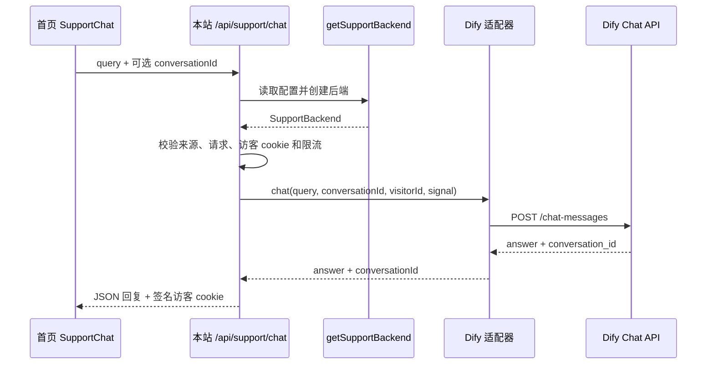

# Support 客服后端实现与切换指南

当前首页客服使用本站 React 窗口，通过 `POST /api/support/chat` 调用服务端，再由 Dify 适配器访问聊天服务。浏览器只依赖本站接口，不需要知道 Dify 的地址、密钥或请求协议。

这使两类切换的改动范围比较明确：

| 切换场景                                            | 需要修改                                                       | 生效方式                                     |
| --------------------------------------------------- | -------------------------------------------------------------- | -------------------------------------------- |
| Dify 自建服务器搬迁、切换 Dify 应用或兼容的云端服务 | `DIFY_API_URL`、`DIFY_API_KEY`                                 | 更新网站服务端环境，重启或重新部署           |
| Dify 内更换模型、提示词或知识库                     | Dify 应用配置                                                  | 按 Dify 应用的发布流程生效，网站协议保持不变 |
| Dify 改为其他聊天平台或自建服务                     | 新增 `SupportBackend` 适配器，修改 `service.ts` 和对应环境配置 | 测试后部署网站代码                           |

当前只实现了 Dify，`service.ts` 固定选择 Dify。没有平台选择菜单、自动故障转移、灰度分流或会话迁移机制。“更换平台”仍需要开发适配器；现有边界使这项工作集中在服务端。

## 请求链路和代码职责



| 文件                                                                | 职责                                                                 |
| ------------------------------------------------------------------- | -------------------------------------------------------------------- |
| [`support-chat.tsx`](../../src/components/support/support-chat.tsx) | 客服窗口、四种语言文案、等待和错误状态、当前页面聊天记录及新对话按钮 |
| [`page.tsx`](../../src/app/[locale]/page.tsx)                       | 首页根据开关渲染入口                                                 |
| [`support.ts`](../../src/config/support.ts)                      | 服务端客服开关，判断 `SUPPORT_CHAT_PUBLIC_ENABLED` 是否严格等于 `true`               |
| [`route.ts`](../../src/app/api/support/chat/route.ts)               | 本站 HTTP 接口、输入校验、匿名访客身份、限流、超时和错误响应         |
| [`backend.ts`](../../src/lib/support/backend.ts)                    | 后端请求、回复和错误的统一契约                                       |
| [`service.ts`](../../src/lib/support/service.ts)                    | 读取服务端配置、创建具体后端                                         |
| [`dify-backend.ts`](../../src/lib/support/dify-backend.ts)          | Dify URL、鉴权、请求字段和响应转换                                   |
| [`strip-reasoning.ts`](../../src/lib/support/strip-reasoning.ts)            | 通用 `stripThinkBlocks()` 函数，删除 `<think>` 块，包括未闭合块；由适配器按需调用                        |

客服窗口不加载第三方聊天 SDK。后端域名变化时，浏览器仍请求同源 API，因此不需要为新的聊天服务器修改浏览器 CSP 或跨域配置；网站服务端必须能访问新的上游地址。

## 统一后端契约

`backend.ts` 定义以下接口：

```ts
export type SupportChatRequest = {
  query: string;
  conversationId?: string;
  visitorId: string;
  signal: AbortSignal;
};

export type SupportChatReply = {
  answer: string;
  conversationId: string;
};

export interface SupportBackend {
  chat(request: SupportChatRequest): Promise<SupportChatReply>;
}
```

- `query`：经本站接口校验并去除首尾空白的问题。
- `conversationId`：后端返回的会话标识，首次对话不传。本站不解释其内部格式，也不把它当授权凭据。
- `visitorId`：本站签发的匿名访客标识，由服务端提供，浏览器请求体不能指定它。
- `signal`：合并客户端取消和 45 秒上游超时的取消信号，适配器应传给实际请求。
- `answer`：供窗口按纯文本显示的回答。当前 UI 不执行 HTML，也不渲染 Markdown。

Dify 适配器将通用字段转换成以下请求：

```text
POST <DIFY_API_URL 去除末尾斜杠>/chat-messages
Authorization: Bearer <DIFY_API_KEY>
Content-Type: application/json
```

```json
{
  "inputs": {},
  "query": "用户问题",
  "conversation_id": "首次为空字符串，后续为已有会话 ID",
  "user": "服务端生成的匿名访客 ID",
  "response_mode": "blocking",
  "auto_generate_name": false
}
```

上游返回的 `conversation_id` 转换为 `conversationId`。回答经过清理后必须非空，会话 ID 必须是非空字符串，否则返回后端错误。由于 `inputs` 固定为空，Dify 应用不能要求额外必填输入变量；如需这些变量，应修改适配器及相应配置。

## 本站 API 的稳定边界

浏览器发送：

```json
{
  "query": "如何部署机器人？",
  "conversationId": "可选的已有会话 ID"
}
```

首次请求应省略 `conversationId`，不要发送示例占位符。成功响应为：

```json
{
  "answer": "客服回答",
  "conversationId": "上游返回的会话 ID"
}
```

接口要求 `Origin` 与本站 origin 完全一致，并要求 `Content-Type` 以 `application/json` 开头。请求体最多 8192 字节；问题最多 2000 个 JavaScript 字符串代码单元且不能全为空白；会话 ID 最多 256 个代码单元，不能包含空格或 ASCII 控制字符。适配器选择新平台时，要确认其会话标识符合这个限制。

| HTTP 状态 | 响应 `error`      | 当前触发条件                                     |
| --------- | ----------------- | ------------------------------------------------ |
| 400       | `invalid_request` | JSON 或字段不合法                                |
| 403       | `forbidden`       | 来源不匹配，包括缺失 Origin                      |
| 413       | `too_large`       | 请求体超过限制                                   |
| 415       | `invalid_request` | Content-Type 不符合要求                          |
| 429       | `rate_limited`    | 本地限流或上游返回 429                           |
| 502       | `unavailable`     | 上游其他非成功状态、响应无效，或未分类异常       |
| 503       | `unavailable`     | 开关未开启，或服务端配置缺失                     |
| 504       | `unavailable`     | Dify 的 fetch 抛出异常，包括网络失败、取消或超时 |

`SupportBackendError` 只接受 `429 | 502 | 504`。适配器用它表达已分类错误；不要把上游错误正文、密钥或内部地址放进返回给浏览器的错误信息。注意当前 504 也可能表示网络失败，不能仅凭这个状态认定发生了超时。

所有经接口 `reply` 返回的响应包含 `Cache-Control: no-store` 和 `X-Request-Id`。进入后端调用阶段的请求会记录请求 ID、状态码和耗时；前置校验提前返回的请求不会进入这段日志。代码不记录问题、回答或密钥。

## 配置与启用

在网站服务端环境配置：

```dotenv
SUPPORT_CHAT_PUBLIC_ENABLED=false
DIFY_API_URL=https://support-api.example.com/v1
DIFY_API_KEY=<Dify 应用 API 密钥>
SUPPORT_CHAT_SESSION_SECRET=<至少 32 字节的随机秘密值>
```

`DIFY_API_URL` 应填写 API 基础地址，包含服务实际要求的路径前缀，例如 `/v1`；不要填写网页聊天链接、管理后台地址或完整 `/chat-messages` 地址。代码只移除末尾一个斜杠后追加 `/chat-messages`。

这些变量都用于服务端，不使用 `NEXT_PUBLIC_` 前缀。`service.ts` 会对 URL 和 API key 去除首尾空白，两者任一缺失就不创建后端。路由还要求 session secret 非空。至少 32 字节是部署要求，代码目前没有校验 secret 长度。

所有网站实例应使用相同的 session secret，以便识别同一访客。正常迁移后端时保留它；轮换会导致旧 cookie 校验失败，访客被重新识别。

设置 `SUPPORT_CHAT_PUBLIC_ENABLED=true` 后入口和 API 才启用。代码读取进程环境变量，不提供在线配置管理功能。修改部署平台变量后，应让新配置进入实际运行实例；首页可能受构建或缓存影响，因此开关变更也要重新部署并验证页面。设为 `false` 可关闭 API，新页面是否隐藏入口需要同时检查。

公开启用前，需要确认网站服务端可访问 Dify HTTPS API，并在边缘层配置跨实例限流与费用保护。代码的内存 Map 仅提供单进程、每访客每分钟 10 次的限制；重启会丢失，多实例不共享，换访客身份也可能绕过，因此还需要 IP 或全局限制。Dify 管理后台和数据库无需向网站访客开放。

## 切换 Dify 服务器或应用

1. 在目标 Dify 环境准备聊天应用，迁移或重建知识库、提示词、模型配置及凭据，确认不需要额外必填 inputs。修改网站环境变量不会自动复制这些资源。
2. 保存当前网站部署版本和原来的 URL、API key 配置，以便回滚。密钥保存在部署平台或约定的本地环境文件，不写入仓库。
3. 在本地或预览环境配置目标 `DIFY_API_URL`、`DIFY_API_KEY`，保持 session secret 稳定，并开启客服开关。
4. 通过首页发送问题，再发送依赖上一轮内容的问题，确认回复和连续对话；用独立浏览器会话确认访客隔离。检查纯文本显示、错误提示、邮件入口和超时表现。
5. 验证通过后，将目标配置应用到生产部署。检查实际首页入口、API 响应及服务端请求日志；不要只确认环境变量已经保存。
6. 更换了应用或无法保留历史会话时，让正在使用旧页面的用户点击“新对话”或刷新页面。当前前端不会自动识别后端已切换，也没有专门的迁移通知。

如果仅更换地址，并且应用、会话数据和访客映射都得到完整保留，旧会话才可能继续工作。不要把相同的 session secret 当作会话可迁移的保证，它只维护本站的访客身份。

出现问题时，恢复旧 URL、API key 和对应部署；如暂时无法恢复，可关闭客服开关。回滚后，新后端产生的会话 ID 同样可能无法用于旧后端，用户仍可能需要开始新对话。当前没有自动重试到备用后端的逻辑。

## 更换为其他后端平台

保持前端和本站 API 协议不变时，主要工作集中在新适配器及 `service.ts`。

1. 新建例如 `src/lib/support/example-backend.ts`，导出创建 `SupportBackend` 的工厂函数。将目标平台的鉴权、字段和响应转换全部放在适配器内。
2. 实现 `chat()`：发送问题和稳定访客身份，正确续接会话，将上游响应转换为 `{ answer, conversationId }`，验证回答及会话 ID，并传递 `signal`。
3. 将上游错误转换为 `SupportBackendError`。需要隐藏模型推理内容的平台，应实现对应的清理规则；Dify 的 `<think>` 清理不会自动应用到新适配器。
4. 在 `service.ts` 读取新平台所需环境变量，配置不完整时返回 `null`，配置完整时返回新适配器。
5. 补充适配器测试，调整现有依赖 Dify 请求格式的测试，再验证本站 API 和前端行为。

装配入口的改动形式如下，示例中的工厂函数需要先自行实现：

```ts
import type { SupportBackend } from "./backend";
import { createExampleBackend } from "./example-backend";

export function getSupportBackend(): SupportBackend | null {
  const baseUrl = process.env.EXAMPLE_SUPPORT_API_URL?.trim();
  const apiKey = process.env.EXAMPLE_SUPPORT_API_KEY?.trim();
  return baseUrl && apiKey ? createExampleBackend(baseUrl, apiKey) : null;
}
```

不需要为了单次迁移先引入平台注册表。如果确实需要通过配置长期保留多个后端，再在装配入口增加选择逻辑；这不是当前已有能力。

目标平台还需要满足以下条件，否则工作范围会超过简单字段转换：

| 目标平台差异                   | 需要处理的内容                                                            |
| ------------------------------ | ------------------------------------------------------------------------- |
| 只接受完整历史消息，不管理会话 | 服务端需要存储并按访客读取历史；当前前端只发送本轮问题和会话 ID           |
| 没有访客与会话归属校验         | 新增服务端归属校验，不能仅凭客户端传入的会话 ID 读取他人历史              |
| 只提供流式响应                 | 在适配器聚合为最终回答，或另外改造本站 API 和前端；当前使用 blocking JSON |
| 要求账号权限或执行业务操作     | 接入本站登录校验和资源授权；匿名 cookie 不提供账号权限                    |
| 响应通常超过 45 秒             | 重新评估服务端、客户端和部署平台时限；只换适配器无法消除超时              |

## 会话、数据和超时

匿名访客 cookie 名为 `support_visitor`，内容为随机 UUID 加 HMAC-SHA256 签名。成功回复后才写入或续期，期限一天，路径为 `/api/support`，设置 HttpOnly 和 SameSite Strict，生产环境增加 Secure。签名防止客户端自行指定有效访客身份；它不证明用户已经登录。

当前会话 ID 和聊天记录只保存在 React 内存中。关闭再打开窗口会保留当前组件中的对话；点击“新对话”清空消息和会话 ID，但不清除访客 cookie；刷新页面会开始新对话。Dify 端仍可能保留历史，需要在上游单独配置保留与删除策略，清空窗口不会删除上游数据。

路由将访客 ID 传给 Dify 的 `user` 字段，会话归属仍需由上游校验。本实现不访问账号、计费或部署数据库，也不执行退款或账号操作。更换服务时，需要重新检查产品资料与政策，不能让回答误导用户认为机器人已经完成业务操作。

服务端传给适配器的超时为 45 秒，客户端等待上限为 50 秒，路由声明 `maxDuration = 60`。部署平台还需支持相应执行时长。组件卸载会取消客户端请求；仅关闭对话框不会主动取消进行中的请求。上游或适配器必须响应取消信号，取消也不保证上游不会计费。

## 验证范围

运行现有检查：

```bash
pnpm exec vitest run src/app/api/support/chat/route.test.ts
pnpm exec tsc --noEmit
```

通用端到端检查只调用本站客服接口，不读取模型平台配置或密钥。更换后端后继续使用：

```bash
pnpm exec tsx scripts/support/check.ts --url http://localhost:3000
pnpm exec tsx scripts/support/check.ts --url http://localhost:3000 --chat
```

默认检查来源和输入校验；`--chat` 额外检查首次问答、携带 cookie 续聊以及跨访客续聊。
客服开关需要开启。若跨访客请求返回 502，只能说明请求未成功，不能据此认定权限隔离通过，
需核对服务端日志，脚本以退出码 2 表示结果待确认；验证失败为 1，全部通过为 0。
受保护的测试环境可用 `--headers-file <文件>` 加载访问认证请求头，
文件格式为 JSON 字符串键值对象，保存在仓库外或被 Git 忽略的位置，不得提交密钥。

Dify 专用检查用于诊断平台连接、应用认证和必填输入参数：

```bash
pnpm exec tsx scripts/support/check-dify.ts
pnpm exec tsx scripts/support/check-dify.ts --chat
```

专用检查默认读取 `.env.local` 和 `.env`，也可用 `--env <文件>` 指定配置。
更换平台时替换对应的专用检查即可。两个脚本的 `--chat` 都会产生模型调用，
结果不输出密钥或聊天内容。

通过反向隧道连接自建服务时，只转发所需 API 路径，其他路径返回 404。
外部入口保留 Dify 应用密钥认证，不开放管理后台。隧道凭据和机器配置只保存在
受限的部署环境中，不能提交到源码仓库。需要从网站实际运行环境再次验证连接，
不能用本地网络测试替代云端验证。

[`route.test.ts`](../../src/app/api/support/chat/route.test.ts) 使用 mock fetch，覆盖凭据不返回前端、推理清理、cookie 身份复用与伪造、跨域拦截、输入限制、错误映射、开关、本地限流以及根据配置生成 Dify URL 和转发会话字段。

这些测试验证本站代码的契约，不证明目标 Dify 可访问，也不证明迁移后的会话数据兼容。测试名称中的“切换主机”用例检查配置 URL 和身份字段，不会实际迁移远端数据或连接两台服务器。

实际切换还需要在目标环境验证：首次问答、连续对话、新对话、独立浏览器访客、旧会话 ID、网络故障、上游 429、超时，以及关闭开关后的首页与 API。更换平台时，应另外覆盖新适配器的协议、取消行为和会话归属检查。
